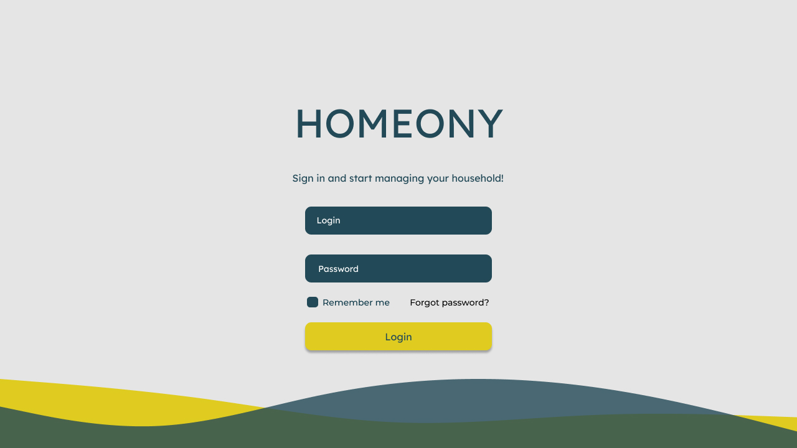

<<<<<<<<< Temporary merge branch 1
# MVP-Complete-Week-2-
Homeony" is a web application that simplifies household management and promotes harmony.
=========
# Homeony

## MVP-Complete-Week-2-

**Homeony** is a web application that simplifies household management and promotes harmony. With this user-friendly app, you can efficiently manage chores, track bills, and maintain your grocery inventory.

 It allows you to create household groups, assign tasks, post bill documents, track grocery needs, and communicate with your household members through a convenient group chat. "Homeony" is your all-in-one solution for a more organized and peaceful living experience.

# Progress Assessment

In Week 2, our "Homeony" household management application project has made remarkable progress. We conducted a thorough assessment of our achievements, identified areas for improvement, and ensured alignment with our goals

Meanwhile, one of the key areas of progress was in Customer Satisfaction and Feedback which we didn’t include in our previous document

The feedback received should be largely positive, also demonstrating that our efforts in providing quality, timely delivery, and responsive customer support will be operational

Finally, the progress assessment this week reflects our commitment to delivering high-quality services, improving operational output, expanding our customer base, and investing in our team's skills and development. By continually assessing our progress and making necessary adjustments, we aim to provide exceptional tent rental experiences and solidify our position as a leading provider in the industry.

# Completed Projects as Planned:

## Website Development and web Notepad System:
We successfully completed the architectural aspects of web development, showcasing features like task assignment, bill tracking, and grocery inventory management. The online note pad system, like to our l project, has been seamlessly integrated, allowing users to efficiently manage household tasks.

## Household Groups and Communication:
Implemented the creation of household groups and a convenient group chat feature to enhance communication among members. This fosters collaboration and promotes harmony within the household.

## Data Models and Databases:
Focused on data models and database setup initially, ensuring a robust foundation for the application. This approach allowed us to smoothly transition to frontend development, optimizing the user interface based on data layouts.

## "Nice to Have" Features:
Once the Minimum Viable Product (MVP) was achieved, we incorporated additional features to enhance user experience and overall functionality. These additions contribute to the comprehensive and user-friendly nature of the "Homeony" app.

## Summary 
our project successfully mirrors the objectives of "Homeony" by delivering a web application that simplifies household management. The integration of features like task assignment, bill tracking, and a web-based notepad system contributes to a more organized and harmonious living experience for users.

# Uncompleted Projects (as Planned):

## API Integration for Advanced Features:
While we have successfully implemented basic features, work is still underway to explore and integrate APIs for advanced functionalities. This includes further enhancements to task management, bill tracking, and grocery inventory.

## Future Enhancements:
Considering the evolving needs of users, our project roadmap includes plans for continuous improvement and the addition of new features. These enhancements will ensure that "Homeony" remains a cutting-edge solution for household management.

# CHALLENGES – in WEEK 2 –

## Technical Challenge:
The primary technical challenge faced during Week 2 was identifying suitable APIs for advanced features. Determining how these APIs fit into the Model-View-Controller (MVC) architecture and aligning them with our HTML progression required careful consideration.

## User Interface Optimization:
Optimizing the user interface based on data layouts posed a challenge. Balancing aesthetics with functionality to create an intuitive and visually pleasing design required meticulous planning and iteration.

## Non-Technical Challenge:
The principal non-technical challenge encountered in Week 2 was managing user expectations regarding app features and functionalities. As "Homeony" aims to simplify household management, ensuring that user needs are met and expectations are exceeded required effective communication and feedback mechanisms.

## User Feedback and Iteration:
Handling user feedback, especially regarding "nice to have" features, presented a non-technical challenge. Balancing user requests with project timelines and priorities required careful consideration to maintain a streamlined development process.

In overcoming these challenges, we focused on effective communication, regular feedback loops, and iterative design processes to ensure that both technical and non-technical aspects were addressed in our ***Homeony*** project.

# Screenshots

